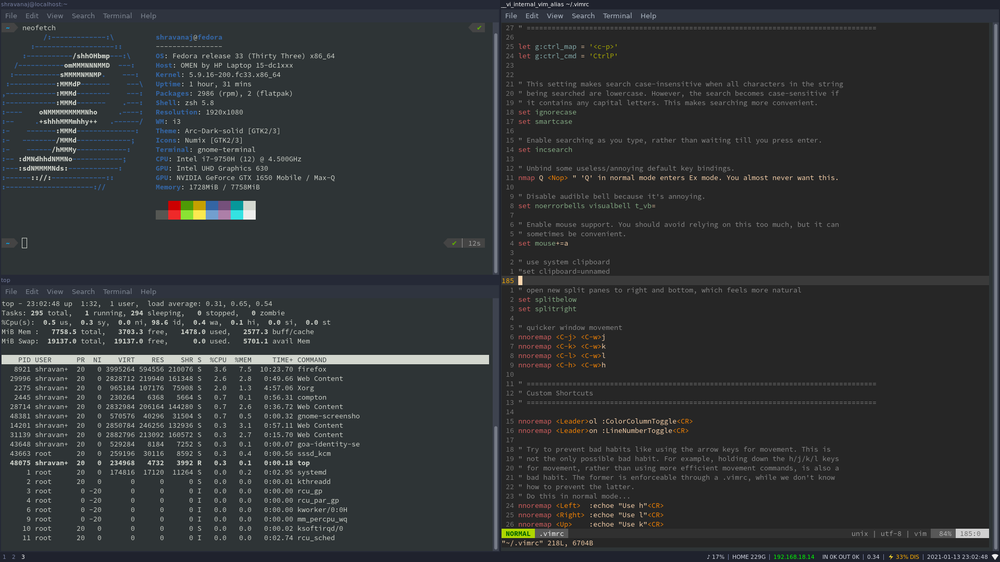

# My Desktop Configuration

This repository contains dotfiles of my development environment. While there are steps mentioned for installing and setting up the same, it's really intented for my own use- you probably won't have much success with it, and would probably be better off reading the individual dotfiles and copying the bits that interest you.

## Development tools used-

- Vim, a hands-on commmand-line editor
- Tmux, a terminal multiplexer
- Bash or zsh (I used both of them interchangeably)
- i3 WM, a tiling window manager



## Setting up the environment-

- Prior to the installation, make sure you have committed the alias to your .bashrc or .zsh-
    ```
    alias config='/usr/bin/config' --git-dir=$HOME/.cfg/ --worktree=$HOME'
    ```
- To ensure that your source repository doesn't create weird recursion problems,
    ```
    echo ".cfg" >> .gitignore
    ```
- Now, clone the dotfiles onto a bare repository in the *"dot"* forlder of your $HOME-
    ```
    git clone --bare <git-repo-url> $HOME/.cfg
    ```
- Define the alias in your current shell scope-
    ```
    alias config='/usr/bin/git --git-dir=$HOME/.cfg/ --work-tree=$HOME'
    ```

In case of any problems, check out this [reference](https://www.atlassian.com/git/tutorials/dotfiles).


